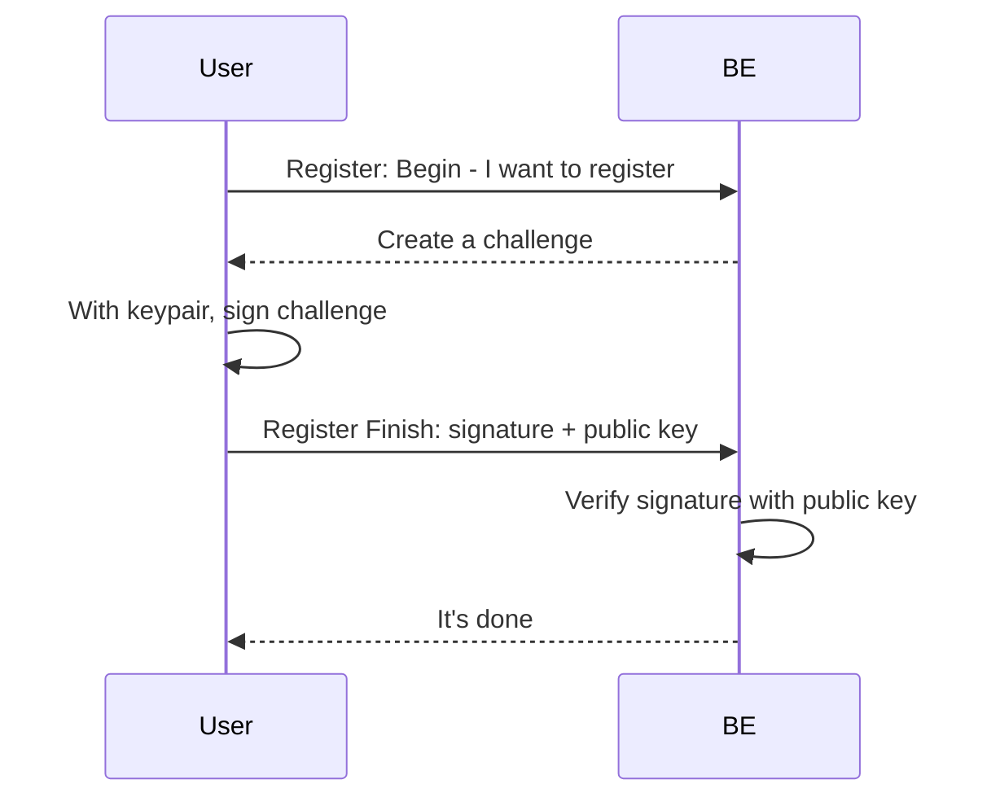
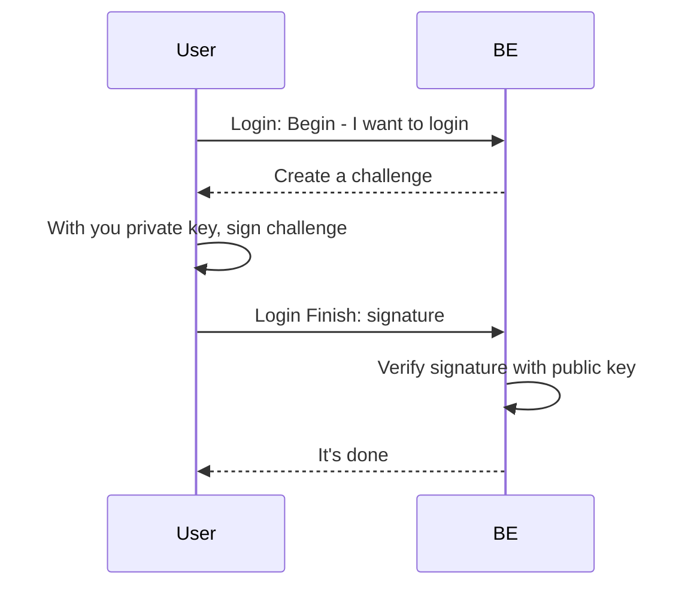

## Registration

```mermaid
sequenceDiagram
    participant U as User
    participant BE as BE
    U->>BE: Register: Begin - I want to register
    BE-->>U: Create a challenge
    U->>U: With keypair, sign challenge
    U->>BE: Register Finish: signature + public key
    BE->>BE: Verify signature with public key
    BE-->>U: It's done
```

## Login

```mermaid
sequenceDiagram
    participant U as User
    participant BE as BE
    U->>BE: Login: Begin - I want to login
    BE-->>U: Create a challenge
    U->>U: With you private key, sign challenge
    U->>BE: Login Finish: signature
    BE->>BE: Verify signature with public key
    BE-->>U: It's done
```
